# MPE

[TOC]

```
<!-- @import "[TOC]" {cmd="toc" depthFrom=1 depthTo=6 orderedList=false} -->
```

https://shd101wyy.github.io/markdown-preview-enhanced/#/zh-cn/

## Markdown Element

### 语法说明

#### 标题 {#flushhip}

#### 强调

*这会是 斜体 的文字*
_这会是 斜体 的文字_

**这会是 粗体 的文字**
__这会是 粗体 的文字__

_你也 **组合** 这些符号_

~~这个文字将会被横线删除~~

#### 列表

- Item 1
- Item 2
  - Item 2a
  - Item 2b

1. Item 1
1. Item 2
1. Item 3
   1. Item 3a
   1. Item 3b

#### 添加图片


#### 链接

[flushhip blog](https://blog.csdn.net/fluship)

#### 引用

> The term virtual private network (abbreviated VPN) describes any technology that can encapsulate and transmit network data, typically Internet Protocol data, over another network. Such a system enables users to access network resources that may otherwise be inaccessible from the public internet. VPNs are frequently used in the information technology sector to provide access to resources for users that are not physically connected to an organisation's network, such as telecommuting workers. VPNs are so named because they may be used to provide virtual (as opposed to physical) access to a private network.

#### 分割线

---

---

---

#### 行内代码

`std::unique_ptr`

#### 代码块

```c++ {.line-numbers highlight=[11-16, 22-23]}
#include <iostream>
#include <string>
#include <chrono>
#include <thread>

#include "config.h"
#include "maths.h"

int main(int argc, char **argv)
{
    if (argc < 2) {
        std::cerr << argv[0] << " Version " << VERSION_MAJOR << "."
            << VERSION_MINOR << "." << VERSION_PATCH << std::endl;
        std::cerr << "Usage: " << argv[0] << " number" << std::endl;
        return 1;
    }

    const double input_value = std::stod(argv[1]);
    const double output_value = math::sqrt(input_value);
    std::cout << output_value << std::endl;

    using namespace std::chrono_literals;
    std::this_thread::sleep_for(2s);

    return 0;
}
```

#### 任务列表

- [ ] @mentions, #refs, [links](), **formatting**, and <del>tags</del> supported
- [x] this is a complete item

#### 表格

First Header | Second Header
------------ | -------------
Content from cell 1 | Content from cell 2
Content in the first column | Content in the second column

### 扩展的语法

#### 表格

colspan `>` or `empty cell`

| a | b |
|---|---|
| > | 1 |
| 2 ||

rowspan `^`

| a | b |
|---|---|
| 1 | 1 |
| ^ | 1 |

#### Emoji

:smile:

#### 上标

30^th^

#### 下标

H~2~O

#### 脚注

Content [^1]

[^1]: Hi! This is a footnote

#### 缩略

_[HTML]: Hyper Text Markup Language
_[W3C]: World Wide Web Consortium
The HTML specification
is maintained by the W3C.

#### 标记

==marked==

## 数学

$x^2 + y^2$
$$x^2 + y^2$$
\(x^2 + y^2\)
\[x^2 + y^2\]

```math
x^2 + y^2
```

## 图像

### Flow Charts

```flow
st=>start: Start:>http://www.google.com[blank]
e=>end:>http://www.google.com
op1=>operation: My Operation
sub1=>subroutine: My Subroutine
cond=>condition: Yes
or No?:>http://www.google.com
io=>inputoutput: catch something...
para=>parallel: parallel tasks

st->op1->cond
cond(yes)->io->e
cond(no)->para
para(path1, bottom)->sub1(right)->op1
para(path2, top)->op1=
```

```flow
st=>start: Start|past:>http://www.google.com[blank]
e=>end: End|future:>http://www.google.com
op1=>operation: My Operation|past
op2=>operation: Stuff|current
sub1=>subroutine: My Subroutine|invalid
cond=>condition: Yes
or No?|approved:>http://www.google.com
c2=>condition: Good idea|rejected
io=>inputoutput: catch something...|future

st->op1(right)->cond
cond(yes, right)->c2
cond(no)->sub1(left)->op1
c2(yes)->io->e
c2(no)->op2->e
```

```flow
st=>start: Improve your
l10n process!
e=>end: Continue to have fun!:>https://youtu.be/YQryHo1iHb8[blank]
op1=>operation: Go to locize.com:>https://locize.com[blank]
sub1=>subroutine: Read the awesomeness
cond(align-next=no)=>condition: Interested to
getting started?
io=>inputoutput: Register:>https://www.locize.app/register[blank]
sub2=>subroutine: Read about improving
your localization workflow
or another source:>https://medium.com/@adrai/8-signs-you-should-improve-your-localization-process-3dc075d53998[blank]
op2=>operation: Login:>https://www.locize.app/login[blank]
cond2=>condition: valid password?
cond3=>condition: reset password?
op3=>operation: send email
sub3=>subroutine: Create a demo project
sub4=>subroutine: Start your real project
io2=>inputoutput: Subscribe

st->op1->sub1->cond
cond(yes)->io->op2->cond2
cond2(no)->cond3
cond3(no,bottom)->op2
cond3(yes)->op3
op3(right)->op2
cond2(yes)->sub3
sub3->sub4->io2->e
cond(no)->sub2(right)->op1

st@>op1({"stroke":"Red"})@>sub1({"stroke":"Red"})@>cond({"stroke":"Red"})@>io({"stroke":"Red"})@>op2({"stroke":"Red"})@>cond2({"stroke":"Red"})@>sub3({"stroke":"Red"})@>sub4({"stroke":"Red"})@>io2({"stroke":"Red"})@>e({"stroke":"Red","stroke-width":6,"arrow-end":"classic-wide-long"})
```

### Sequence Diagrams

```sequence {theme="hand}
Andrew->China: Says Hello
Note right of China: China thinks\nabout it
China-->Andrew: How are you?
Andrew->>China: I am good thanks!
```

```sequence {theme="hand}
Title: Here is a title
A->B: Normal line
B-->C: Dashed line
C->>D: Open arrow
D-->>A: Dashed open arrow
```

```sequence {theme="hand}
# Example of a comment.
Note left of A: Note to the\n left of A
Note right of A: Note to the\n right of A
Note over A: Note over A
Note over A,B: Note over both A and B
```

```sequence {theme="hand}
participant C
participant B
participant A
Note right of A: By listing the participants\n you can change their order
```

### Mermaid

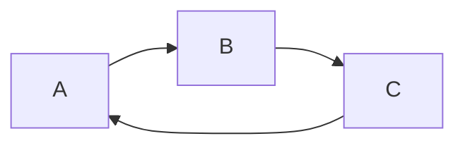

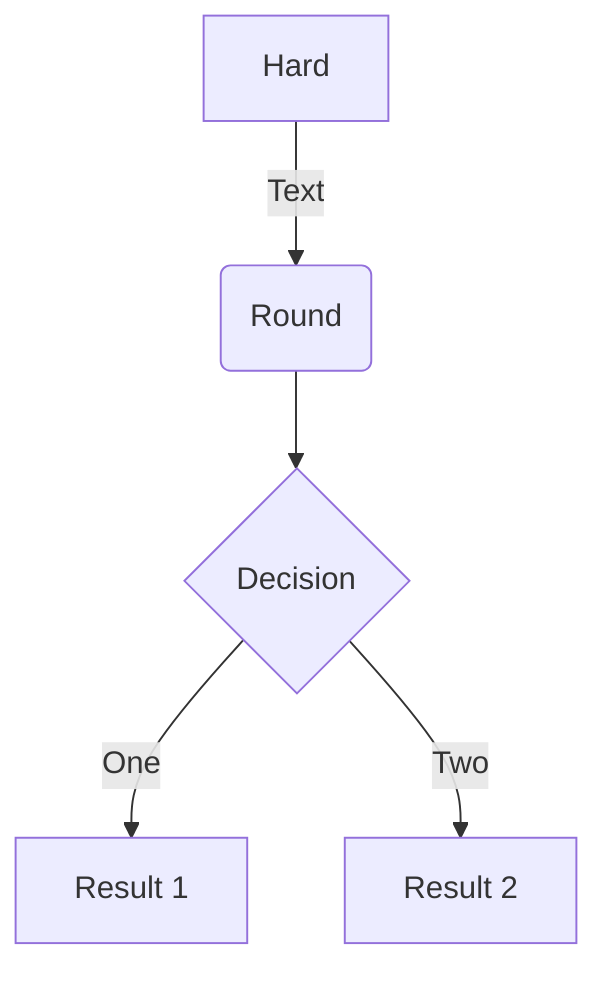

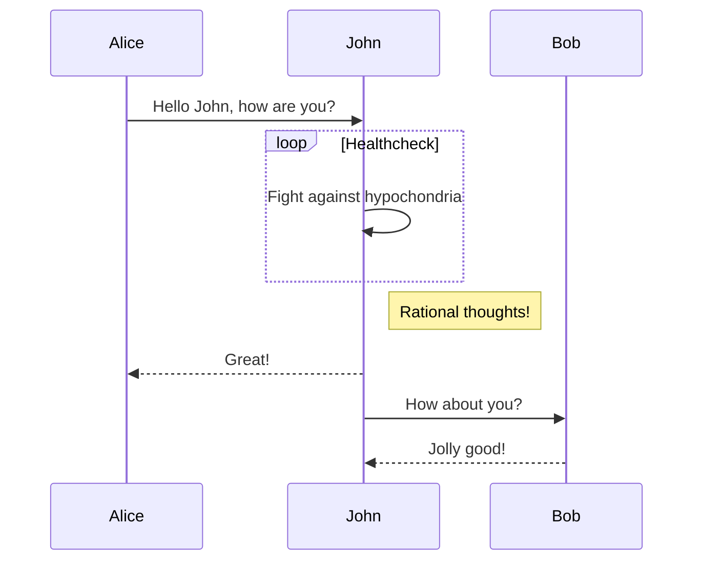

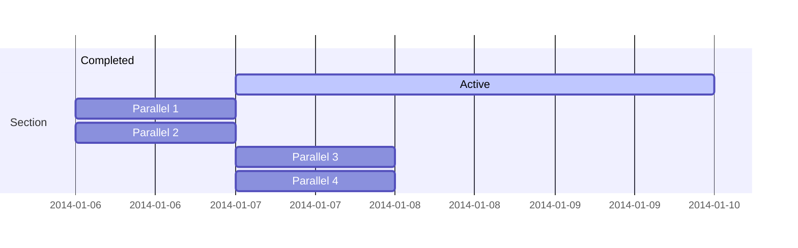

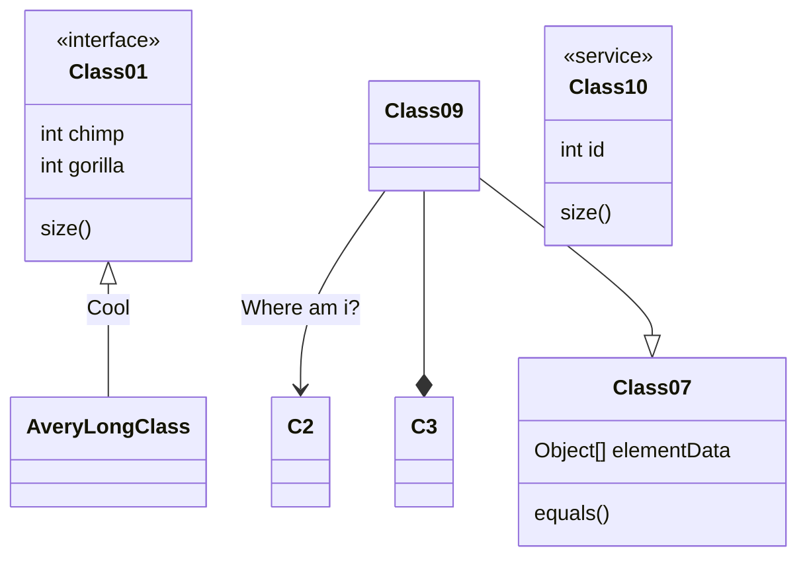

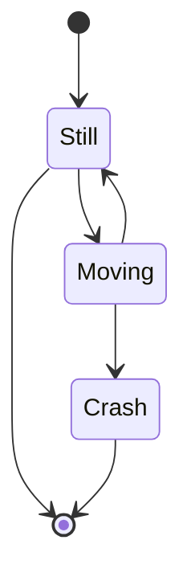

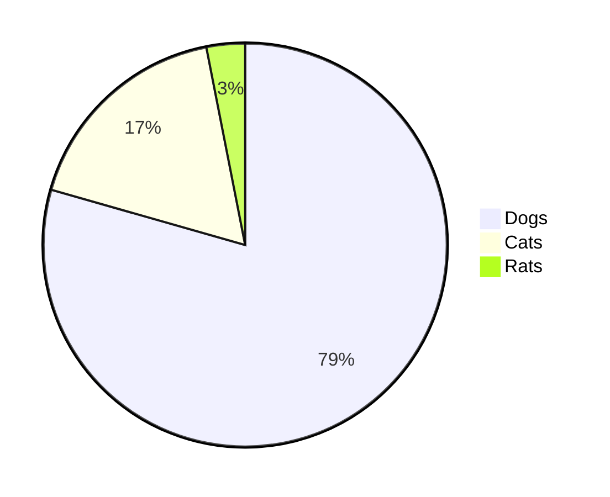

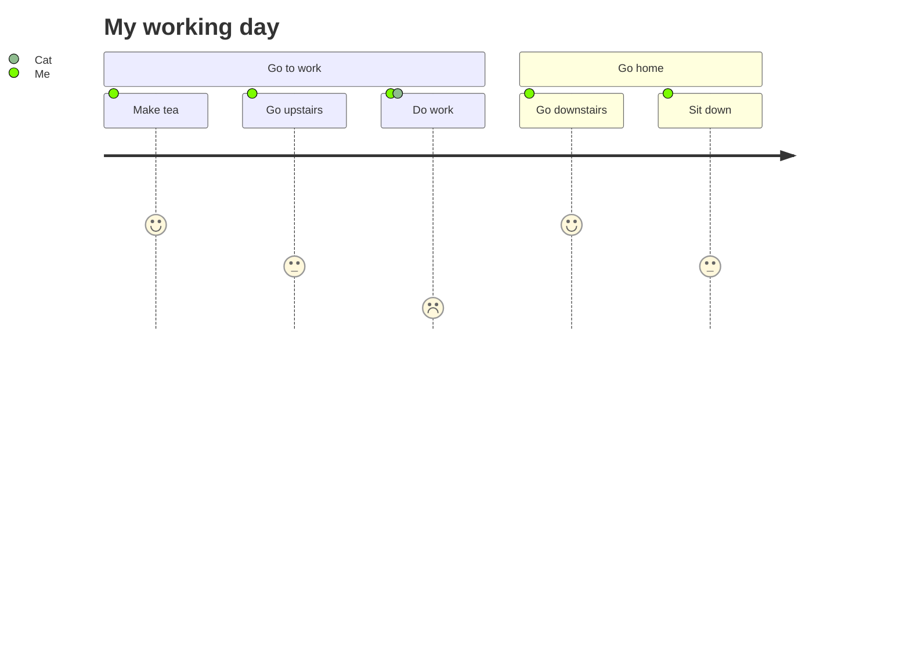

### PlantUML

```puml
A -> B
```

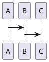

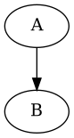

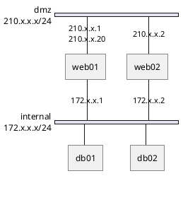

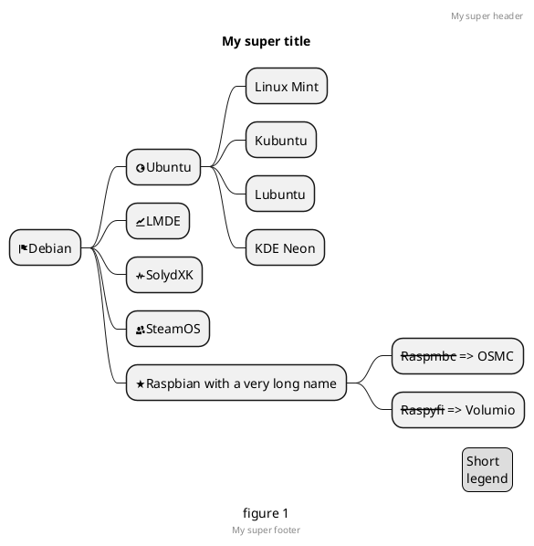

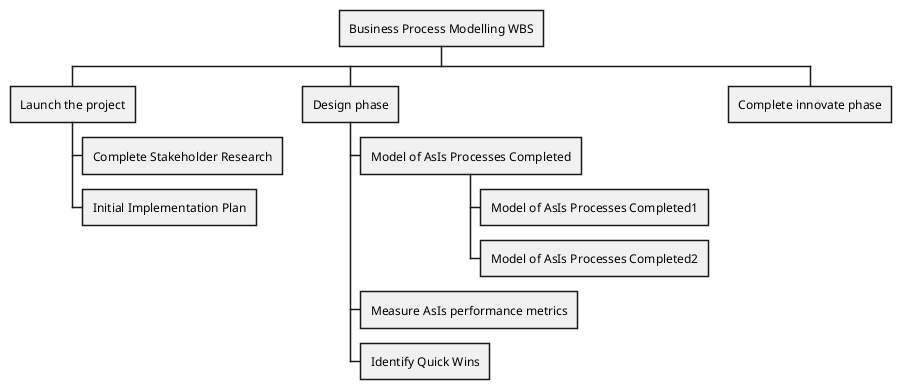

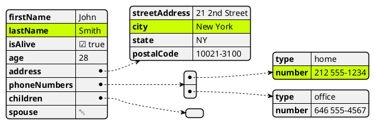

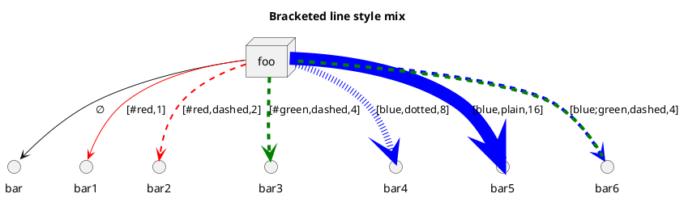

### WaveDrom

```wavedrom
{ signal: [{ name: "Alfa", wave: "01.zx=ud.23.456789" }] }
```

```wavedrom
{ signal: [
  { name: "pclk", wave: 'p.......' },
  { name: "Pclk", wave: 'P.......' },
  { name: "nclk", wave: 'n.......' },
  { name: "Nclk", wave: 'N.......' },
  {},
  { name: 'clk0', wave: 'phnlPHNL' },
  { name: 'clk1', wave: 'xhlhLHl.' },
  { name: 'clk2', wave: 'hpHplnLn' },
  { name: 'clk3', wave: 'nhNhplPl' },
  { name: 'clk4', wave: 'xlh.L.Hx' },
]}
```

```wavedrom
{ signal: [
  { name: "clk",  wave: "P......" },
  { name: "bus",  wave: "x.==.=x", data: ["head", "body", "tail", "data"] },
  { name: "wire", wave: "0.1..0." }
]}
```

```wavedrom
{ signal: [
  { name: "clk",         wave: "p.....|..." },
  { name: "Data",        wave: "x.345x|=.x", data: ["head", "body", "tail", "data"] },
  { name: "Request",     wave: "0.1..0|1.0" },
  {},
  { name: "Acknowledge", wave: "1.....|01." }
]}
```

```wavedrom
{ signal: [
  {    name: 'clk',   wave: 'p..Pp..P'},
  ['Master',
    ['ctrl',
      {name: 'write', wave: '01.0....'},
      {name: 'read',  wave: '0...1..0'}
    ],
    {  name: 'addr',  wave: 'x3.x4..x', data: 'A1 A2'},
    {  name: 'wdata', wave: 'x3.x....', data: 'D1'   },
  ],
  {},
  ['Slave',
    ['ctrl',
      {name: 'ack',   wave: 'x01x0.1x'},
    ],
    {  name: 'rdata', wave: 'x.....4x', data: 'Q2'},
  ]
]}
```

```wavedrom
{ signal: [
  { name: "CK",   wave: "P.......",                                              period: 2  },
  { name: "CMD",  wave: "x.3x=x4x=x=x=x=x", data: "RAS NOP CAS NOP NOP NOP NOP", phase: 0.5 },
  { name: "ADDR", wave: "x.=x..=x........", data: "ROW COL",                     phase: 0.5 },
  { name: "DQS",  wave: "z.......0.1010z." },
  { name: "DQ",   wave: "z.........5555z.", data: "D0 D1 D2 D3" }
]}
```

```wavedrom
{ signal: [
  { name: "clk",     wave: "p...." },
  { name: "Data",    wave: "x345x",  data: ["head", "body", "tail"] },
  { name: "Request", wave: "01..0" }
  ],
  config: { hscale: 1 }
}
```

```wavedrom
{signal: [
  {name:'clk',         wave: 'p....' },
  {name:'Data',        wave: 'x345x', data: 'a b c' },
  {name:'Request',     wave: '01..0' }
],
 head:{
   text:'WaveDrom example',
   tick:0,
 },
 foot:{
   text:'Figure 100',
   tock:9
 },
}
```

```wavedrom
{signal: [
  {name:'clk', wave: 'p.....PPPPp....' },
  {name:'dat', wave: 'x....2345x.....', data: 'a b c d' },
  {name:'req', wave: '0....1...0.....' }
],
head: {text:
  ['tspan',
    ['tspan', {class:'error h1'}, 'error '],
    ['tspan', {class:'warning h2'}, 'warning '],
    ['tspan', {class:'info h3'}, 'info '],
    ['tspan', {class:'success h4'}, 'success '],
    ['tspan', {class:'muted h5'}, 'muted '],
    ['tspan', {class:'h6'}, 'h6 '],
    'default ',
    ['tspan', {fill:'pink', 'font-weight':'bold', 'font-style':'italic'}, 'pink-bold-italic']
  ]
},
foot: {text:
  ['tspan', 'E=mc',
    ['tspan', {dy:'-5'}, '2'],
    ['tspan', {dy: '5'}, '. '],
    ['tspan', {'font-size':'25'}, 'B '],
    ['tspan', {'text-decoration':'overline'},'over '],
    ['tspan', {'text-decoration':'underline'},'under '],
    ['tspan', {'baseline-shift':'sub'}, 'sub '],
    ['tspan', {'baseline-shift':'super'}, 'super ']
  ],tock:-5
}
}
```

```wavedrom
{ signal: [
  { name: 'A', wave: '01........0....',  node: '.a........j' },
  { name: 'B', wave: '0.1.......0.1..',  node: '..b.......i' },
  { name: 'C', wave: '0..1....0...1..',  node: '...c....h..' },
  { name: 'D', wave: '0...1..0.....1.',  node: '....d..g...' },
  { name: 'E', wave: '0....10.......1',  node: '.....ef....' }
  ],
  edge: [
    'a~b t1', 'c-~a t2', 'c-~>d time 3', 'd~-e',
    'e~>f', 'f->g', 'g-~>h', 'h~>i some text', 'h~->j'
  ]
}
```

```wavedrom
{ signal: [
  { name: 'A', wave: '01..0..',  node: '.a..e..' },
  { name: 'B', wave: '0.1..0.',  node: '..b..d.', phase:0.5 },
  { name: 'C', wave: '0..1..0',  node: '...c..f' },
  {                              node: '...g..h' }
  ],
  edge: [
    'b-|a t1', 'a-|c t2', 'b-|-c t3', 'c-|->e t4', 'e-|>f more text',
    'e|->d t6', 'c-g', 'f-h', 'g<->h 3 ms'
  ]
}
```

```wavedrom
(function (bits, ticks) {
  var i, t, gray, state, data = [], arr = [];
  for (i = 0; i < bits; i++) {
    arr.push({name: i + '', wave: ''});
    state = 1;
    for (t = 0; t < ticks; t++) {
      data.push(t + '');
      gray = (((t >> 1) ^ t) >> i) & 1;
      arr[i].wave += (gray === state) ? '.' : gray + '';
      state = gray;
    }
  }
  arr.unshift('gray');
  return {signal: [
    {name: 'bin', wave: '='.repeat(ticks), data: data}, arr
  ]};
})(5, 16)
```

### GraphViz

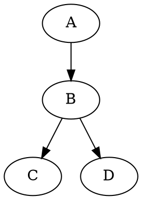


```dot {engine="circo"}
digraph G {
    A -> B
    B -> C
    B -> D
}
```

### Vega

```vega
{
  "$schema": "https://vega.github.io/schema/vega/v5.json",
  "description": "A basic stacked bar chart example.",
  "width": 500,
  "height": 200,
  "padding": 5,

  "data": [
    {
      "name": "table",
      "values": [
        {"x": 0, "y": 28, "c": 0}, {"x": 0, "y": 55, "c": 1},
        {"x": 1, "y": 43, "c": 0}, {"x": 1, "y": 91, "c": 1},
        {"x": 2, "y": 81, "c": 0}, {"x": 2, "y": 53, "c": 1},
        {"x": 3, "y": 19, "c": 0}, {"x": 3, "y": 87, "c": 1},
        {"x": 4, "y": 52, "c": 0}, {"x": 4, "y": 48, "c": 1},
        {"x": 5, "y": 24, "c": 0}, {"x": 5, "y": 49, "c": 1},
        {"x": 6, "y": 87, "c": 0}, {"x": 6, "y": 66, "c": 1},
        {"x": 7, "y": 17, "c": 0}, {"x": 7, "y": 27, "c": 1},
        {"x": 8, "y": 68, "c": 0}, {"x": 8, "y": 16, "c": 1},
        {"x": 9, "y": 49, "c": 0}, {"x": 9, "y": 15, "c": 1}
      ],
      "transform": [
        {
          "type": "stack",
          "groupby": ["x"],
          "sort": {"field": "c"},
          "field": "y"
        }
      ]
    }
  ],

  "scales": [
    {
      "name": "x",
      "type": "band",
      "range": "width",
      "domain": {"data": "table", "field": "x"}
    },
    {
      "name": "y",
      "type": "linear",
      "range": "height",
      "nice": true, "zero": true,
      "domain": {"data": "table", "field": "y1"}
    },
    {
      "name": "color",
      "type": "ordinal",
      "range": "category",
      "domain": {"data": "table", "field": "c"}
    }
  ],

  "axes": [
    {"orient": "bottom", "scale": "x", "zindex": 1},
    {"orient": "left", "scale": "y", "zindex": 1}
  ],

  "marks": [
    {
      "type": "rect",
      "from": {"data": "table"},
      "encode": {
        "enter": {
          "x": {"scale": "x", "field": "x"},
          "width": {"scale": "x", "band": 1, "offset": -1},
          "y": {"scale": "y", "field": "y0"},
          "y2": {"scale": "y", "field": "y1"},
          "fill": {"scale": "color", "field": "c"}
        },
        "update": {
          "fillOpacity": {"value": 1}
        },
        "hover": {
          "fillOpacity": {"value": 0.5}
        }
      }
    }
  ]
}

```

### Ditaa

```ditaa {cmd=true args=["-E"] align="center"}
  +--------+   +-------+    +-------+
  |        | --+ ditaa +--> |       |
  |  Text  |   +-------+    |diagram|
  |Document|   |!magic!|    |       |
  |     {d}|   |       |    |       |
  +---+----+   +-------+    +-------+
      :                         ^
      |       Lots of work      |
      +-------------------------+
  ```

## TOC

## 导入文件

## Code Chunk

## 幻灯片

## Pandoc
